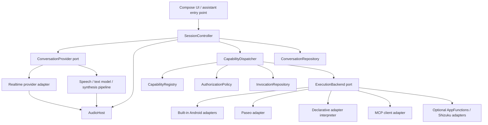
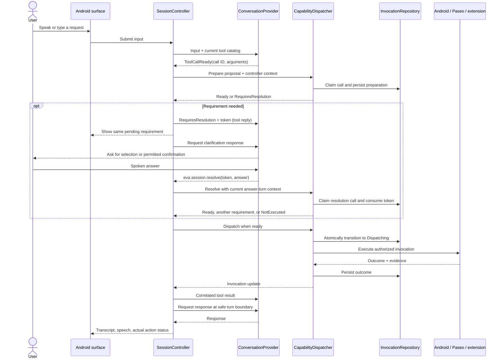

# EVA technical architecture and implementation sketch

Status: proposed target architecture; see [implementation status](implementation.md)
for the initial implemented subset and the merged voice POC.
Prepared: 2026-09-12.

This document translates the [product design](design.md) into component
boundaries, contracts, and an incremental implementation plan. The design owns
product goals and acceptance scenarios; the [proof-of-concept plan](proof-of-concept.md)
owns the voice experiments. The repository also contains a browser voice POC and
the first typed Android action slice. The contracts below describe the target
design, not a claim that every interface or extension form is implemented.

The [device-control extension design](device-control-extension.md) applies these
contracts to the Shizuku/UiAutomation mechanism. Its first bundled slice is
integrated and emulator-verified; the general extension package and Android 17
compatibility remain unimplemented or unverified as described there.

## 1. Architectural decisions

EVA should own the conversation, authorization, and record of actions. A voice
or model provider supplies understanding and responses; it proposes actions
through typed tool calls. Integrations implement those actions behind a common
capability interface. Neither the UI nor an integration depends on a particular
voice vendor.

There are two independent kinds of extensibility:

- **Conversation providers** change how EVA recognizes speech, reasons, and
  generates speech. Support both integrated realtime services and compositions
  of speech recognition, a text model, and speech synthesis.
- **Capability adapters** change what EVA can do. Built-in Android code, Paseo,
  imported declarations, and MCP connections all register capabilities with
  the same dispatcher.

Local Android actions work with either a cloud or local conversation provider.
Local speech recognition and synthesis do not imply local reasoning. A fully
offline assistant would additionally need a local model or a deliberately
limited command interpreter; that is a later provider implementation, not an
assumption of this architecture.

Start with packages inside the existing `:app` module and explicit constructor
injection. Keep core contracts free of Android and vendor SDK types so they can
be tested on the JVM and extracted into modules when needed. Do not build a
general plugin runtime before proving one voice-to-action vertical slice.

## 2. Components and dependency boundaries



Arrows show calls through interfaces, not Gradle dependencies or network hops.
Provider and backend implementations depend on core contracts. The application
composition root chooses implementations and supplies platform services.

| Component | Owns | Boundary |
| --- | --- | --- |
| UI and Android entry points | Invocation, input, permission dialogs, transcript and status rendering | Submit commands and observe state; never call providers or tools directly |
| `SessionController` | Turn ordering, canonical conversation, provider events, tool-result delivery | No Android intents, remote API methods, or credential parsing |
| `ConversationProvider` | Protocol adaptation, provider context, tool-schema translation | Cannot acquire capability execution authority |
| `AudioHost` | Capture/playback leases, routing, focus, reported playback position, immediate stop | No tool routing or interpretation of requests |
| `CapabilityRegistry` | Versioned catalog, adapter identity, backend bindings, availability | Discovery does not execute actions |
| `CapabilityDispatcher` | Validation, target resolution, authorization, durable dispatch and outcomes | Only route from a proposed tool call to an action |
| `ExecutionBackend` | One integration's translation to an external API or local operation | No implicit retries of uncertain writes or permission escalation |
| Repositories | Conversation, invocations, configuration and connection references | Persist domain records, not provider SDK objects |
| `CredentialStore` | Scoped credential references and secret retrieval | Never supplies credentials to prompts or tool results |

Keep app-owned coroutines for conversation and execution coordination. An
Activity or assistant surface subscribes while visible; rotation does not
create a second provider session or invocation. These coroutines do not survive
process death. Durable records support recovery; they are not a promise of
uninterrupted background execution.

## 3. Conversation provider contract

The [provider adapter contract](provider-contract.md) specifies the shared
catalog projection, input/output records, translation rules, and first-provider
conformance evidence. Provider wire formats remain inside their adapters.

### Shared session interface

The sketches use Kotlin coroutines and JSON values as conceptual types; omitted
supporting types are domain records, not existing dependencies. Start with only
the methods exercised by the first provider and fake implementation.

```kotlin
interface ConversationProvider {
    val id: ProviderId
    suspend fun describe(config: ProviderConfig): ProviderCapabilities
    suspend fun open(request: SessionOpenRequest): ConversationSession
}

interface ConversationSession {
    val events: Flow<ProviderEvent>
    suspend fun submit(input: ConversationInput)
    suspend fun replaceTools(catalog: ProviderToolCatalog): CatalogAck
    suspend fun submitToolResult(result: CorrelatedToolResult)
    suspend fun requestResponse(request: ResponseRequest)
    suspend fun interrupt(request: ResponseInterruption): InterruptionAck
    suspend fun close()
}
```

`SessionOpenRequest` contains an EVA session ID, provider configuration reference,
instructions, bounded canonical history, the initial tool catalog, and an audio
lease when needed. Credentials are resolved by the provider's scoped credential
source. They do not become part of persisted history.

The controller composes instructions from application policy, user settings,
and enabled instruction bundles. Bundles contribute attributed prompt content;
they cannot change dispatcher policy or introduce executable tools.

`ProviderCapabilities` describes actual supported behavior:

- Text input/output, audio input/output, optional transcript availability.
- Audio mode: none, EVA-managed frames, or backend-managed media under an
  `AudioHost` lease. A WebRTC implementation need not copy media through JSON.
- Tool mode: client-executed structured calls, bridged structured calls, or no
  tools; supported schema subset and limits on names/catalog size.
- Turn detection, interruption and context-truncation support, tool-catalog
  updates, session resumption, and any usage reporting available.
- Authentication/billing mode, processing location, and network requirements.
- Known connection-duration limits and whether response creation can be
  controlled separately from input/result submission.

These are capability values, not vendor-name conditionals in the controller.
An audio-only provider can be offered as speech output or conversational chat,
but cannot be presented as an action-capable runtime without a structured tool
path. Unsupported schema features must cause explicit adaptation or rejection;
silently dropping a constraint is not a compatibility strategy. EVA still
validates original schemas locally.

Pin tool-name bindings to a catalog revision for each response. Update tools only
at a quiescent response boundary and use revisions acknowledged by the adapter.
The acknowledgment reflects protocol support or completed setup, not an assumed
vendor event. If delayed calls cannot be associated with their generating
revision, retain the old bindings or reopen the connection; never attach the
latest catalog merely because it is current at receipt. Providers without live
updates reopen at a turn boundary. Local revocations take effect immediately
even when the provider still has an older tool list.

A **quiescent boundary** has no active user utterance, generated response, queued
playback, or unresolved provider tool exchange. A pending token whose requirement
reply has closed the exchange and an accepted remote job do not prevent quiescence.
Use this boundary for catalog changes, planned connection rotation, and notice
injection; newly arriving input always takes precedence over a queued response.

### Conversation, interaction, and connection lifetime

A persisted conversation may span many interactions. An interaction starts on
invocation and owns a provider connection, audio leases, and pending user
requirements. Open the connection on invocation; reuse it between turns while
the interaction is active. During idle, release capture and stop output. Close
after a configurable bounded idle timeout or a known provider-duration limit.
M1 closes on dismissal rather than promising background keepalive. Continuous
listening is an explicit active mode, not idle capture.

Reopening retains the conversation ID and creates a new connection epoch,
seeding bounded canonical history. Provider-limit rotation waits for a safe
boundary when possible; forced expiry uses the same recovery rules as a drop.
Measure warm latency only with an established usable connection and report
invocation-to-response including setup separately. Idle policy must disclose
connection usage/billing; configurable keepalive never bypasses Android lifecycle
requirements or provider limits.

### Events, identity, and history

Normalize protocol events into `Connected`, `CaptureStateChanged`,
`UserSpeechStarted`, `InputEnded`, `InputTranscript`, `ResponseStarted`,
`TextDelta`, `ToolCallReady`, `ResponseEnded`, `UsageUpdated`, and
`ProviderFailure`. Platform capture events come from the audio owner when the
provider does not supply them. Events carry EVA turn, response-generation, and
connection-epoch IDs, plus provider item/call IDs where applicable.

`ToolCallReady` means arguments are complete, not a partial JSON delta. It
includes the adapter-associated catalog revision and opaque provider call ID. The
adapter maps protocol-safe tool names back to stable EVA capability IDs. Tool
names are unique within the session catalog, even when two MCP servers expose
the same name. Reject stale or unknown bindings instead of guessing.

The controller uses a single ordered event loop to reduce commands/events into
`SessionState`, exposed as `StateFlow` to the UI. Exactly one collector consumes
provider control events; reconnecting UI subscribers never re-execute tools.
Buffer initial events until that collector is attached. A bounded control lane
carries final input/text, tool calls, and outcomes; overflow fails the session
explicitly rather than dropping a tool call. Coalesce replaceable display
deltas separately and keep media frames off the control lane. Item IDs and
source ordering preserve transcript/tool order when final records are assembled;
coalescing must not discard canonical final content.

The event loop only reduces state and schedules effects. Provider I/O, backend
execution, and permission dialogs run outside it and report correlated completion
events; waiting for them must not block interruption or new input.

Persist user turns, assistant content, interrupted/heard status, tool proposals,
and invocation outcomes in provider-neutral form. Keep provider-native resume
tokens as optional metadata. An interruption must not leave an unheard full
answer recorded as though it was delivered. Providers without transcripts may
support only limited cross-provider context; disclose that limitation rather
than inventing a transcript.

Reconnection creates a new epoch. Late response fragments from the old epoch
cannot speak or initiate new actions. Already-dispatched jobs remain tracked
by invocation ID independently. Replayed calls from the same provider session
map to the existing preparation/invocation and recorded reply. Use the stable
provider-session/call identity across resumable connections, not the connection
epoch as the deduplication key. A new provider session gets a new identity scope.
Do not deduplicate merely by tool name and arguments: the user may intentionally
repeat an action. Do not replay an old user request as fresh input on reconnect
or profile switch; unresolved writes remain explicit in canonical context and
require reconciliation or a new user decision, not regenerated calls with new IDs.

Every claimed complete tool call gets one durable logical reply: an execution
outcome, `RequiresResolution`, or `NotExecuted` with a reason such as denied,
stale, superseded, invalid, or expired. A later job update is a notice, not a
replacement reply. Record delivery attempts separately; exactly-once delivery
over an arbitrary provider transport is not guaranteed. Resend only when the
provider can safely correlate the stored reply; otherwise restore consistent
history without a dangling live tool exchange and surface an app-authored notice.
Never repeat execution to repair a missing provider reply.

### Results, notices, and response scheduling

`ConversationInput` distinguishes user text/audio from `ConversationNotice`, an
app-authored update carrying invocation ID, outcome revision, evidence, and
provenance. The controller turns background completions and results orphaned by
connection/profile changes into notices. Remote result text remains untrusted
content inside the notice; the notice itself is not a new user instruction.

Input and tool-result submission update provider context; `requestResponse`
separately authorizes generation. The controller queues unsolicited notices
while a user utterance or response is active, coalesces job revisions, and
requests speech only at an appropriate boundary. An enabled mic alone does not
mean an utterance is active. With no live interaction, update history/UI without
opening a provider connection or starting speech. Profile changes reapply data
disclosure policy before old results enter the new provider's context.
Seed eligible undelivered notices on the next open and record their inclusion
per provider session; inclusion in context is distinct from audible delivery.
If setup fails before inclusion is established, leave delivery uncertain and
deduplicate by notice ID/revision when recovering.

Adapters disable automatic response creation where supported. If submission
necessarily triggers a response, defer submission until the controller grants
that opportunity; do not claim an independent append-only operation. A provider
that cannot support safe turn scheduling must advertise that limitation and
cannot supply the full action runtime. Track a response request against current
turn/generation so delayed notices cannot speak over newly detected input.

### Integrated realtime and composable speech

An integrated realtime adapter implements `ConversationProvider` directly. A
pipeline implementation composes smaller replaceable interfaces:

```kotlin
interface SpeechRecognizerProvider {
    suspend fun start(request: RecognitionRequest): RecognitionSession
}

interface TextModelProvider {
    fun respond(request: ModelTurnRequest): Flow<ModelEvent>
}

interface SpeechSynthesizerProvider {
    suspend fun start(request: SynthesisRequest): SynthesisSession
}
```

`RecognitionSession` provides partial/final transcript events and finish/cancel
controls. Its request specifies locale, processing policy, and an audio lease.
`ModelTurnRequest` contains canonical history and the acknowledged tool catalog;
its events include text and complete structured tool calls. `SynthesisSession`
accepts text segments, reports playback progress, and exposes finish/stop.
Implementations advertise streaming and locale support rather than requiring
every engine to stream.

The pipeline sends a finalized utterance to the text model, emits any tool call
to the controller, waits for the dispatcher result, and then continues the model
turn. It does not execute tools internally. A segmenter queues speakable text
while preserving turn IDs; interruption clears pending segments as well as
current playback. Start with push-to-talk and sentence-level synthesis before
optimizing partial recognition or speculative generation.

| Configuration | Implementation | What varies |
| --- | --- | --- |
| Integrated realtime service | One conversation adapter | Provider media protocol, turn detection, voice and tool semantics |
| Cloud speech + text model + cloud synthesis | Pipeline with three adapters | Each service and credential can be selected independently |
| Android speech + selected text model + Android synthesis | Pipeline using platform speech adapters | Device engines/languages may constrain availability and offline behavior |
| Future entirely local configuration | Local recognition, local model/command interpreter, local synthesis | Model resources, latency and command coverage require separate validation |

Store named `ConversationProfile`s containing provider IDs, endpoint/model/voice
settings, credential references, locale, processing policy, and explicit fallback
preferences. Configuration validation negotiates a working combination before
listening. Switching profiles closes the current provider transport and seeds a
new session with supported canonical context. It never replays old mutations.
Pending results remain in the invocation history even if the new provider cannot
continue the old tool exchange.
Closing an interaction or switching profiles expires unresolved preparations
and resolution tokens. Existing dispatched actions keep their invocation IDs
and continue independently; the new profile does not inherit old approval prompts.

The subscription-backed candidate remains gated by the POC plan. A bridge must
produce the same structured events and route actions through EVA; delegation
text is not a tool call. Keep bridge setup/authentication separate from media
transport and from the Paseo capability adapter. Failure must not silently
switch to a billable or less-private provider.

### Audio ownership and interruption

`AudioHost` grants separate exclusive capture and playback leases. A realtime
engine may own both; a pipeline gives capture to its recognizer and playback to
its synthesizer. Acquisition is coordinated to avoid competing capture owners
or deadlock. Backend-managed owners handle native media under those leases;
PCM owners exchange bounded frames with an explicit format. The host coordinates
routing/focus and requires local stop/release from every owner.

The playback owner reports item identity and heard position with its accuracy,
which may be estimated or unknown. EVA cannot infer exact playback from received
WebRTC packets or synthesized text. Use the last confirmed boundary when possible;
otherwise preserve interrupted/unknown status and repair provider context rather
than fabricating a heard transcript. The initial speech pipeline is half-duplex:
push-to-talk and a stop button, with acoustic barge-in added only when supported
and tested. The stop latency target applies to local output after detection or
button activation, separately from detection and remote-context latency.

On barge-in, stop and flush local output first, advance the response generation,
then notify the provider with the item ID and last played position. Truncate
remote context if supported; otherwise mark the response interrupted and
reestablish context before the next response if necessary. Ignore queued output
from the old generation. A new utterance invalidates uncommitted automatic calls
from the old response, including calls received earlier but still queued. The
dispatcher orders invalidation against its atomic `Dispatching` transition;
only actions past that boundary may continue independently. Answer suppressed
calls with `NotExecuted` when their provider exchange remains usable. An explicit
audio-only stop does not invalidate work. Canceling a dispatched action is a
separate dispatcher command, with a separate outcome.

Preparations deliberately awaiting a clarification/confirmation survive into
the answer turn through their resolution token; they cannot auto-dispatch from
the old generation. Only an explicit current resolution can resume them.
They expire through TTL, interaction close/profile change, explicit denial, or
explicit supersession by a replacement preparation tied to the token. A new
utterance alone is not evidence of denial or correction.

Listening and speaking may overlap for full-duplex providers. Represent capture,
connection, response, and outstanding jobs as separate state fields rather than
one enum that cannot express "listening while a remote job runs."

## 4. Capabilities, planning, and execution

### Catalog and backend contracts

Separate a **capability** (a semantic operation), a **binding** (its concrete
backend and target), and an **invocation** (one authorized logical action, with
separately recorded transport attempts).
An extension contains one or more capabilities; it is not itself an invocation.

First-party actions are bundled extension packages. Map search, navigation,
messaging, and app-specific actions use the same definition format, loader,
schema validation, catalog, authorization, dispatcher, and receipt contract.
Bundling establishes installation provenance and a reserved namespace; it does
not establish a separate execution path or bypass authorization. An action
definition supplies its description, schemas, binding, and presentation metadata.
The model selects an enabled capability and supplies arguments; it does not
construct its binding or depend on a command parser.

Separate action definitions from the runtime mechanisms that execute them.
An intent executor interprets a validated declaration; it does not contain a
branch for each app or capability ID. A native Android operation may require
compiled support, but a package binds to that operation through the same
contract as an imported package. Introducing a new operation can require an EVA
release; defining another action using an existing operation must not require
registry, controller, provider, or UI changes. AppFunctions and MCP discovery
produce the same catalog descriptors and immutable bindings from external
metadata, without hand-authoring a wrapper for each discovered function.

```kotlin
data class CapabilityDescriptor(
    val id: CapabilityId,
    val revision: String,
    val owner: AdapterInstanceId,
    val title: String,
    val description: String,
    val inputSchema: JsonObject,
    val outputSchema: JsonObject?,
    val resultContent: ResultContentContract,
    val effects: EffectDescriptor,
    val requirements: Set<Requirement>,
    val execution: ExecutionSemantics,
)

interface CapabilityAdapter {
    val id: AdapterInstanceId
    suspend fun discover(): CatalogSnapshot
    val invalidations: Flow<CatalogInvalidation>
}

interface ExecutionBackend {
    suspend fun availability(binding: CapabilityBinding): Availability
    suspend fun execute(invocation: AuthorizedInvocation): ExecutionOutcome
}

interface ReconcilableBackend {
    suspend fun reconcile(record: InvocationRecord): ExecutionOutcome
}

interface CancelableBackend {
    suspend fun cancel(record: InvocationRecord): CancellationOutcome
}
```

`ExecutionSemantics` declares foreground requirements, cancellation support,
idempotency/reconciliation support, and whether acceptance may precede completion.
Async backends can additionally expose progress observation; reconciliation must
still work when an event stream is interrupted, or report that it is unavailable.
Calling `execute` performs one attempt. Collecting progress must never initiate
or repeat that attempt.

`ResultContentContract` declares required/optional media types and any supported
text-only projection, separately from the JSON output schema. Existing data-only
definitions default to no required media. The installed operation supplies the
supported content forms; a definition cannot claim a projection the operation
does not implement. Catalog compatibility checks these against the selected
provider before activation.

Opaque result/target references belong to their producing operation and are
resolved against the authorized invocation, installed instance, target and
current access state. Possession of a reference never grants execution or data
access. Resource-owning backends can manage scoped native handles internally;
they do not require a separate dispatcher or a universal resource-lease API.

Namespaces distinguish shipped capabilities (`eva.android.timer.start`) from
imports (`extension.<installed-id>.<operation>`) and server instances
(`mcp.<connection-id>.<tool>`). Human labels can change without changing identity.
Reject namespace collisions. Preserve the original external name only inside
the owning adapter's binding.

Availability is structured: `Available`, `NeedsPermission`, `NeedsForeground`,
`NeedsUnlock`, `Disconnected`, `Unsupported`, or `Unknown`, with actionable
reasons. Refresh discovery on relevant configuration/package/connection changes,
cache off the turn path, and recheck at execution time. An unavailable optional
backend must not make unrelated capabilities disappear.

### Dispatcher interface and authorization boundary

```kotlin
interface CapabilityDispatcher {
    suspend fun prepare(proposal: ToolProposal, context: ProposalContext): Preparation
    suspend fun resolve(resolution: RequirementResolution, context: ProposalContext): Preparation
    suspend fun invalidateGeneration(generation: ResponseGenerationId)
    suspend fun dispatch(id: PreparedInvocationId): InvocationId
    fun observe(id: InvocationId): Flow<InvocationRecord>
    suspend fun cancel(id: InvocationId): CancellationOutcome
}
```

`Preparation` is `Ready`, `NeedsTarget`, `NeedsAuthorization`, `NeedsUserAction`,
or `Rejected`. A prepared record fixes the capability/catalog revision, validated
arguments, concrete target, selected backend, effect summary, deadline, and
app-owned authorization reference. The provider never constructs
`AuthorizedInvocation`; only the dispatcher creates it after policy checks.

`prepare` atomically claims the provider-session/call identity before creating
prompts or doing external work. Duplicate delivery returns the same preparation
and logical reply, including when the first call is awaiting the user. A claim
starts as pending and recovery completes its reply; claiming and replying are
not an atomic transaction with the provider. The original call and subsequent
resolution calls have independent replies and a many-to-one mapping to the
logical action. `dispatch` atomically transitions the existing action into
`Dispatching`, rather than claiming the call anew.

`ProposalContext` is assembled by the controller, not by model arguments. It
contains turn/epoch/generation identity, trigger (user turn, tool continuation,
notice, or surface-attested action), retained untrusted-context provenance,
active target references, surface/access snapshot, authorization references,
and remaining chain budget.
Prefer explicit resolved IDs in tool arguments; active-target context is only a
default. Recheck live access and interaction state rather than treating snapshots
as permanent grants.

Policy combines user-enabled capabilities, grants scoped to targets/accounts,
Android access state, and operation effects. Previously granted routine actions
proceed without repeated prompts. Imported descriptions and MCP annotations are
claims, not grants; unknown effects receive conservative treatment. Any pending
confirmation binds to the immutable prepared arguments and target. Target or
argument changes invalidate it. Recheck revocation, expiry, availability, and
adapter revision immediately before dispatch.

Routine capability enablement is distinct from permission to initiate mutations
within a tool chain or background continuation. A proposal from the initial
response to new user input can use the user's routine operation/target grant.
Mutations proposed by tool-result or notice continuations require authorization
for that exact action or an explicitly granted scope for chained operations;
otherwise return `NeedsAuthorization`. Controller-owned response lineage tracks
this distinction; a provider cannot relabel a continuation as fresh user input.

Retained untrusted-context provenance remains available for audit and stricter
optional policy; it does not automatically force confirmation on every later
user-triggered action. Cap chain depth and bind grants to concrete operations
and targets. This structural distinction does not prove that the model followed
the user's intent: prompt injection can affect even an initial response through
retained context. Routine and autonomous grants accept that residual risk;
marking content as data or trusting tool annotations does not itself grant a write.

### Spoken and surface-based requirement resolution

For `NeedsTarget`, `NeedsAuthorization`, or `NeedsUserAction`, return
`RequiresResolution` as the original tool reply; `Rejected` gets `NotExecuted`.
Include the requirement, candidate IDs or exact effect summary, and an
opaque EVA-issued expiring resolution token. This closes that tool exchange
without discarding the pending action. The token correlates a resolution; it is
not proof of user consent and never grants permission by possession alone.

Include the reserved built-in `eva.session.resolve` control capability in the
initial catalog of every action-capable session. It cannot be shadowed by an
extension; resolving a requirement must not depend on a live catalog update.
It counts toward provider tool limits and is not independently disableable within
an action-capable session; token validity and policy govern its use. In no-tools
mode it is absent, and any requirement resolution uses the surface.
Its structured arguments select/deny/confirm the referenced requirement; it
enters the same dispatcher rather than an integration backend. Resolution is a
new provider call with its own single reply, tied to the existing logical action. UI taps
call `resolve` on the same record with app-attested provenance. If the UI resolves
after the original exchange has closed, deliver its outcome through a notice.

An unresolved-target token binds the candidate set and all already-fixed
arguments. Selecting a candidate fixes the target and consumes that token;
additional authorization gets a new token bound to the exact selected action.
Confirmed target/arguments cannot be silently edited. Different arguments or a
target outside the candidates require a new preparation. Atomic token consumption
prevents competing voice/UI answers from dispatching twice; repeated resolution
calls return the recorded outcome. Expired/denied tokens cannot revive work.

For confirmation and target selection, a model resolution must belong to a
response generation following new user input received after the corresponding
`RequiresResolution` reply's recorded submission for provider-context inclusion.
Record that input-sequence boundary with the token; the same tool chain cannot
self-confirm it. This is a structural
check, not an inference that the input means yes. Trusted UI resolutions carry
surface proof instead. A spoken confirmation is still model-mediated
interpretation, not independently attested
consent. Operations configured to require a trusted surface cannot be approved
by a model-emitted `confirm`; permission dialogs likewise require platform UI.
This preserves low-friction voice confirmation where the user allows it without
pretending that model relay is a security boundary.

Initially each capability has one binding. Android, AppFunctions, and Shizuku
variants have distinct IDs; no automatic backend selection is needed for M1-M3.
A later semantic facade may select among bindings before preparation, but the
selected binding must be authorized and persisted. Replacing a stock intent
with a privileged backend changes authority/result semantics and cannot be an
invisible fallback. Similar extension tools remain distinct.

### Outcomes and durable correctness

| Outcome | Meaning and evidence |
| --- | --- |
| `Completed` | The action's completion criterion is met; include structured result and source/time |
| `Accepted` | Target accepted work; include target/job reference and whether progress can be observed |
| `HandedOff` | Another app/UI received the request; completion has not been established |
| `Failed` | A known failure; record whether any partial effects occurred |
| `Canceled` | Cancellation is confirmed; retain any effects that already happened |
| `Unknown` | Submission or completion cannot be determined; retain any earlier acceptance evidence and reconcile or ask the user |

These describe execution, not protocol handling. `RequiresResolution` and
`NotExecuted` are tool-reply states, with no implied external attempt. The
capability's output schema applies to its data payload; EVA's outcome/evidence
envelope remains consistent across adapters. An invalid output after dispatch
is not proof the action failed or permission to retry it.

Results can additionally reference bounded media artifacts through a common
`ArtifactRef` content form: opaque identity, media type, size/digest, optional
dimensions, expiry and availability. The artifact owner retains invocation,
instance, target and disclosure scope. Resolve content only after authorizing
disclosure to the selected provider; do not put local paths or arbitrary fetch
URLs in model arguments. Provider adapters translate permitted content using
negotiated media capabilities. Artifact expiry does not erase an outcome and
must never trigger another execution to recreate bytes. See the
[provider content contract](provider-contract.md#result-artifacts-and-media-compatibility).

Persist a new invocation before external dispatch and mark it `Dispatching`
before crossing the backend boundary. Store attempts, resolved target, sanitized
arguments, request digest, authorization reference, backend revision, remote
IDs, and outcome evidence. Keep the earlier call claim linked to preparation,
invocation, and recorded reply. Repository uniqueness and atomic state transitions
prevent concurrent dispatch of the same action or reuse of a resolution token.

There is no transaction spanning local storage and an arbitrary external app.
A crash after marking `Dispatching` but before recording the result is therefore
uncertain, even if the operation might never have reached the target. On restart,
reconcile using a remote handle or target-supported idempotency key. If neither
exists, retain `Unknown` and do not automatically repeat the write. A locally
generated invocation ID alone provides no remote exactly-once guarantee.

Retry only when execution semantics establish safety. Transport timeout or
coroutine cancellation after sending a write is not proof of failure or rollback.
`Accepted` is not terminal job completion. Persist progress when available and
reconcile after reconnect; a backend without observable completion remains
accepted rather than being promoted to success by a timer. Repeated tool-result
delivery uses the recorded invocation result, not another backend execution.

A cancellation request is not confirmed cancellation. Merge cancellation and
completion by authoritative evidence and remote revision where available, not
by whichever network message arrived first. Confirmed completion/effects cannot
be erased by a late cancel acknowledgment. Conflicting evidence stays visible
and requires reconciliation; a terminal local label must not hide an observed
external effect. Losing progress observation also does not erase known acceptance.
Corrections to an already-replied outcome reach the conversation as notices;
they do not overwrite or re-deliver the original tool reply as a different result.

Initially serialize mutation submissions per adapter instance; later adapters
can derive narrower resource keys from resolved targets. Hold serialization
through the submission outcome, not an entire accepted remote job. An uncertain
write blocks automatic retry or replacement of that action until reconciled or
explicitly resolved. Allow bounded independent reads. Long jobs return acceptance
promptly so they do not monopolize the voice loop. Closing the session releases
audio/network resources for that conversation but does not cancel remote work.

## 5. Built-in local Android support

Ship local Android actions as packages using the extension contract in section 6.
Implement reusable execution mechanisms beneath those packages. Platform work lives behind ports
such as `IntentLauncher`, `PermissionGateway`, and `DeviceState`; the dispatcher
never holds an Activity. `PermissionGateway` requests foreground UI interaction
through the active surface and reports its result, or reports unavailable UI.

| Bundled action | Initial binding contract | Evidence and limits |
| --- | --- | --- |
| Navigation/open URI | Typed destination converted to a supported intent | Successful launch is `HandedOff`; no claim that navigation began |
| Timer | Bounded positive duration and optional label mapped to `ACTION_SET_TIMER` | Add `SET_ALARM` only with implementation; report handoff unless completion can be observed |
| Dial/share | Typed number or content mapped to a user-visible intent | Opening dialer/share UI is not placing a call or sending a message |
| Future data/media adapters | Specific content-provider, media-session, or notification contracts | Each needs its own access checks and result semantics |

Use documented [common intents](https://developer.android.com/guide/components/intents-common).
Build intents from typed arguments; never accept arbitrary model-generated
intent URIs, flags, components, or extras. Narrow package/intent queries should
accompany the features that require discovery. A filtered query is not proof
that launch is impossible; catch launch failures and account for Android's
[package-visibility behavior](https://developer.android.com/training/package-visibility/use-cases).

The launcher Activity is the initial invocation surface. A later assistant
entry point uses `VoiceInteractionService` and its session surface to reach the
same controller. Keep the service lightweight, with resource ownership tied to
an active interaction. Selection as the system assistant does not grant general
control over apps. Verify system invocation, locked-device behavior, audio and
background transitions on hardware. See the
[platform service contract](https://developer.android.com/reference/android/service/voice/VoiceInteractionService).

Android speech adapters are separate from Android action adapters.
`SpeechRecognizer` can use a service that sends audio to a server; merely choosing
the Android API does not establish offline processing. The explicit on-device
factory and availability check are API 31+, so the current minSdk 23 requires
runtime guards and a clear unavailable path. Release recognizers correctly and
respect main-thread requirements. See
[SpeechRecognizer](https://developer.android.com/reference/android/speech/SpeechRecognizer).
For synthesis, inspect the selected voice's network requirement and installed
language data rather than assuming every engine is offline. See
[Voice.isNetworkConnectionRequired](https://developer.android.com/reference/android/speech/tts/Voice#isNetworkConnectionRequired()).
An offline-only profile fails visibly when local resources are unavailable.

AppFunctions and Shizuku are optional execution backends, not prerequisites for
the registry or Android adapter interface. Gate AppFunctions by OS feature,
caller authorization, target function and enabled state; current documentation
requires `EXECUTE_APP_FUNCTIONS` for callers. See the
[AppFunctions overview](https://developer.android.com/ai/appfunctions).
Shizuku must expose only typed supported operations through a narrowly scoped
service, with its identity/lifecycle tested on the actual device. Do not expose
an unrestricted shell tool. Privilege loss invalidates bindings and cannot
trigger silent resubmission through another backend. The POC/design experiments
must establish this path before it is advertised as working.

The [device-control extension](device-control-extension.md) packages typed UI
operations through the native-operation binding kind in section 6. Shizuku and
UiAutomation remain private implementation details; ordinary capability grants,
outcomes, cancellation, and provider projection still apply. The standalone
API 36 experiment verifies the native mechanism, not this integrated contract.

## 6. Custom extensions

### Three extension paths

Declarative packages, AppFunctions, and installed extension apps share
`CapabilityAdapter`, grants, admission, journaling, and attributed receipts.
Declarative packages adapt existing apps via intents, content providers, and HTTP
without app code changes. AppFunctions uses the optional Shizuku shell bridge.
The [installed-service protocol](extension-protocol.md) lets an author expose
structured result envelopes from their own app on supported stock Android,
without Shizuku. Discovery is on; it never grants execution authority.

Installed-service and declarative HTTP/intent paths and file/HTTPS imports are
implemented and JVM-tested. Caffeine and Messages intent handoffs are device-tested;
installed-service IPC and HTTP execution remain unverified on a device.
The generalized AppFunctions adapter remains planned. See [package design](declarative-packages.md)
for HTTPS repository import, content queries, and the future App Actions
investigation. Additions appear on the next connection; revocation blocks new
dispatch. In-turn approval, catalog rotation, polling, and MCP remain deferred.

### One action contract, multiple execution mechanisms

Use one versioned package format for bundled and imported action definitions.
Their source and installation policy differ; their definition semantics do not.
Compiled code implements execution mechanisms and discovery protocols, rather
than a privileged alternative to the package contract for core actions.

| Binding kind | Definition source | Execution environment |
| --- | --- | --- |
| Android intent | Bundled or imported package | EVA's constrained intent interpreter |
| Native Android operation | Bundled or imported package referencing an installed operation | Typed Android service/API implementation in EVA |
| AppFunctions | Authorized discovery of installed apps' function metadata | Target app through the platform execution protocol |
| MCP | Discovery through an enabled connection | Server process; EVA is the protocol client |
| HTTP | Bundled or imported package | EVA's constrained HTTP interpreter |

Device control uses the native Android operation row, not a new binding kind.
The optional bundled `eva.device-control` package and imported definitions that
reference its admitted public operations use identical enforcement. Helper
startup, shell commands and permission-grant internals are never exported as
package operations. The [device-control specification](device-control-extension.md)
defines the operation boundaries, observation references, effects and evidence.

Native operation implementations share the app's trust boundary. Constructor
interfaces enforce architecture, not a sandbox against malicious native
libraries. Definitions can reference only installed, version-compatible
operations. Each implementation defines its argument constraints, permission
requirements, minimum effects, and possible outcome evidence. Package schemas
may narrow these contracts, but cannot relax them. Validate arguments against
the package schema and then the operation's own schema. A package cannot introduce
new Android privileges, executable code, or arbitrary Android API calls.
The installed operation table is versioned and participates in compatibility
checks. Runtime-owned `exposure: bundled | public` metadata determines which
definitions the loader may bind: `bundled` accepts only installed shipped
definitions, while `public` also accepts imported definitions. A document cannot
choose its own provenance or increase an operation's exposure. This constrains
binding admission; it does not bypass schema, effect, or authorization checks
for either source. Internal control operations have no package binding entry.
New privileged operations can start bundled-only and become public after the
same imported-binding conformance checks pass; no alternate runtime API is needed.
Public operations have the same permission and effect enforcement for bundled
and imported definitions; provenance alone is not authority to send a message.
Runtime-owned effect summaries and confirmations do not trust package prose.
For the first public communication operations, recipient and message body must
come from explicit invocation arguments, not package constants or hidden
defaults. When policy requires confirmation, show resolved arguments and any
other permitted binding constants using runtime-owned UI. Imported mutations
start without grants; approved grants remain bound to their installed instance
and binding digest. Import does not request Android runtime permissions; the
permission gateway handles availability requirements at invocation. Internal
privileged experiments are not automatically part of the public operation table.

For example, map search and Google Maps driving navigation are two definitions
using the intent interpreter, with different fixed URI structures. An imported
third-party app action uses that interpreter with its documented URI/extras
mapping. SMS composition is another intent definition. Direct SMS sending is a
distinct definition bound to a native SMS operation, if implemented and
authorized; changing a compose definition must never silently grant send
authority. The native operation supplies sent-callback evidence, while the
intent interpreter supplies only handoff evidence. A declared result mode cannot
upgrade a handoff to a completed send.

The registry validates definitions and looks up bindings without switches on
capability IDs. Provider adapters translate catalog schemas rather than maintain
their own action list. Generic receipt rendering uses bounded presentation
metadata and runtime-owned outcome states; an unfamiliar action must never
inherit a Maps label. Persist the display and evidence snapshot needed to render
an invocation after its package changes or is removed. Package text is untrusted
display data and cannot override outcome state or required confirmation UI.

Provider configuration can point to compatible custom endpoints, but an endpoint
is only interchangeable when its protocol and capabilities match. A new speech
protocol initially requires a compiled provider adapter. Importing a capability
extension does not install a new audio codec or arbitrary Kotlin code.

Instruction bundles can add vocabulary and workflows referencing installed
capability IDs. They have no independent execution privileges. Separately
installed Android extension apps use the versioned IPC contract linked above,
with caller identity and explicit grants. Shipped declarative HTTP and intent
packages and file/repository imports are implemented; remote MCP remains later work.

### Declarative package sketch

Use a single JSON document rather than executable archives. The implemented
[package spec](declarative-packages.md) is authoritative. This earlier conceptual
sketch illustrates encoded slots; it is not accepted package JSON:

```json
{
  "formatVersion": 1,
  "id": "community.maps",
  "version": "0.1.0",
  "capabilities": [{
    "name": "showAddress",
    "description": "Open a map search for an address",
    "inputSchema": {
      "type": "object",
      "properties": {"address": {"type": "string", "minLength": 1}},
      "required": ["address"],
      "additionalProperties": false
    },
    "binding": {
      "kind": "android.intent",
      "action": "android.intent.action.VIEW",
      "uri": {
        "base": "geo:0,0",
        "query": {"q": {"argument": "address"}}
      }
    },
    "resultMode": "handoff"
  }]
}
```

The interpreter constructs the URI with encoded parameters. It does not perform
raw string substitution. Core-owned binding rules derive the action's minimum
effect classification and allowed intent fields; an import cannot label a write
as a harmless read to bypass policy.
Intent arguments can fill typed, encoded slots only. Action, URI scheme, extra
keys, and any permitted target package are fixed by the approved definition.
No model-supplied components, flags, nested parcelables, or parsed intent URIs
are allowed. Every template-intent mapping has a conservative external-action
effect floor; its action name alone is not proof of read-only behavior. Grants
are scoped to the approved binding, not to all uses of the intent interpreter.

HTTP declarations are implemented for shipped packages ahead of general import
and MCP, so existing documented endpoints can be used without app-side changes.
HTTP bindings declare a user-approved origin, method, typed path/query/body
mapping, credential reference, bounded timeout/response size, and explicit result
mapping. Arguments cannot choose a new origin or authorization header. Credentials
are attached only to their approved origin; redirects cannot forward them or
escape the approved destination. Private/tailnet endpoints are supported when
explicitly configured. No shell expressions, evaluated scripts, arbitrary class
names, or embedded secrets belong in the format. An HTTP success status alone
does not establish completion of asynchronous work.

Import proceeds through parse/size limits, format/schema validation, compatibility
checks, a preview of operations/destinations/data disclosure, then user enablement.
EVA generates an installed-instance ID at first import. The document's `id` is
descriptive metadata, not authority to replace another installation. Store
immutable revisions and content digests under that instance. Capability IDs
derive from the installed instance so an import cannot shadow shipped or existing
capabilities. A digest identifies content; it does not authenticate a publisher.

Updating an installed instance is an explicit user action and installs atomically.
Retain grants only within the same instance and unchanged approved binding,
schema, destinations, authority, and effects. A new installation does not inherit
another instance's grants by declaring the same name. Catalog invalidation
removes old proposals, while prepared calls revalidate their revision before
dispatch. Disabling/removing an extension blocks new calls immediately and
retains historical outcomes. It does not undo already-started external work;
preserve enough connection metadata to reconcile it where possible.

### MCP adaptation

For the first Android client, target remote Streamable HTTP and negotiate the
protocol version. Do not assume a local stdio process or JavaScript runtime.
Server transport/session IDs are separate from invocation IDs; a lost MCP
session does not prove a tool did not run. See
[MCP transports](https://modelcontextprotocol.io/specification/2025-11-25/basic/transports).

Map `tools/list` and list-change notifications into catalog discovery and
invalidation. Map `tools/call` results, including tool errors and structured
content, into EVA outcomes through the adapter. Do not infer asynchronous job
semantics from arbitrary prose; servers lacking a structured job contract return
only the evidence they expose. Keep tool names scoped by connection. Treat tool
annotations as untrusted hints. See
[MCP tools](https://modelcontextprotocol.io/specification/2025-11-25/server/tools).

Initially support tools only; resources, prompts, sampling, and elicitation are
separate capabilities to implement and negotiate deliberately. Authentication
and token refresh live in the MCP connection owner with endpoint-scoped secrets.
EVA executes all enabled MCP calls through its dispatcher instead of handing
private connections directly to a model provider's server-side tool runner.
Bind per-tool grants to the configured connection identity and a digest of its
schema/effect contract; discovery changes invalidate affected grants. A server
annotation is not proof of harmlessness. Users may explicitly grant particular
operations/scopes to a trusted connection, including chained execution, but
protocol annotations alone cannot reduce authorization requirements.
At grant time, show the server's claimed effects separately from the effective
EVA policy, including any user-selected classification that differs from the hint.

## 7. Paseo adapter and remote jobs

Define a semantic `PaseoClient` port for listing agents, reading status/output,
creating work, sending follow-ups, and interrupting work. These names describe
EVA operations, not assumed wire method names. Keep protocol version handling,
transport, authentication and reconnect inside its implementation. Choose native
Kotlin transport versus an SDK bridge only after protocol inspection, as required
by the design and POC; neither choice changes the dispatcher contract. First
evaluate reusing the MCP client transport behind this semantic facade. This is
conditional on the configured daemon exposing the necessary operations over a
reachable, authenticated Android-compatible transport; seeing MCP tools in an
agent's environment does not establish remote Streamable HTTP support.

If that path satisfies M2's targeting, acknowledgment, and recovery needs, bring
the required MCP transport forward from M3 and defer general server-configuration
UI. Add a native protocol client or bridge only for required missing semantics
such as event streams or pairing, rather than duplicating a sufficient transport.
The built-in Paseo adapter exposes only EVA's curated operations and effect
classifications. Its MCP connection is an implementation transport, not automatic
import of the daemon's entire tool catalog. Additional daemon operations require
deliberate capabilities and grants regardless of transport reachability.

References carry stable host identity plus remote workspace/agent IDs:

```kotlin
data class AgentRef(val host: HostId, val agent: RemoteAgentId)
data class WorkspaceRef(val host: HostId, val workspace: RemoteWorkspaceId)
```

Remember an active target as explicit session context. Human names help select
it, but a mutation requires resolved IDs and a verified connection identity.
Ambiguity returns `NeedsTarget` before dispatch. Profile/model/permission defaults
come from user configuration and available daemon settings.

A create/follow-up result becomes `Accepted` only when the daemon acknowledges
it. Record returned IDs immediately and attach later progress to that invocation.
Persist event cursors and deduplicate if the protocol supplies stable identities;
otherwise reconcile with a fresh bounded status read instead of inventing event
ordering guarantees. A dropped create response is `Unknown` unless the protocol
provides a safe way to recover the created work. Never re-create an agent just
because the voice session reconnects.

Treat direct tailnet and relay connections as different transport implementations
with their own pairing/authentication requirements. A network address is not
server identity. The optional voice-session broker and this action adapter may
share a host, but the registry must work with either absent.

## 8. End-to-end request flow



The diagram shows spoken resolution; UI taps enter the same dispatcher with
surface provenance. Requirements can recur (target selection followed by a
permission grant); each resolution call gets its own reply. Denied, superseded,
or expired actions exit without dispatch. The original `RequiresResolution`
reply is never overwritten; the eventual execution outcome answers the resolving
call or is delivered as a notice for a UI resolution. Later job progress uses
notices independently of either exchange.

For "set a timer for ten minutes," validation produces a 600-second duration,
resolves the Android binding, and checks its requirements. Successful intent
launch yields `HandedOff`; EVA can say it opened the clock with that request,
not assert verified timer state.

For "tell that agent to add settings," resolve the host-qualified agent before
sending. Daemon acknowledgment yields `Accepted` and the reply describes that
acceptance. Completion, if observable later, updates the job separately. An
audio interruption during either request stops speech immediately while the
invocation record continues to track what actually happened.

## 9. Storage, privacy, and Android lifecycle

Use a relational store (proposed: Room) for conversations, invocations/attempts,
remote-job references, and installed extension revisions. Use a small settings
store (proposed: DataStore) for active profiles and preferences. These libraries
are future implementation choices, not current scaffold dependencies. Credential
references point to secrets encrypted with Android Keystore-backed keys; keep
secrets outside the conversation/job database and exclude them from backup.
Also exclude conversation, tool-result, and invocation databases from automatic
cloud backup/device transfer by default; implement those rules when the stores
are introduced. The scaffold currently enables backup and needs an explicit
review of both legacy and current backup rules at that point. Export is a
separate user action with its own disclosure choices.

Define retention and deletion for transcripts, tool arguments/results, and
diagnostics. Default raw audio retention is off. Minimize canonical history and
tool catalog sent to providers; mark screen/app/remote content as data rather
than authority. Surface which configured service receives audio, text, and tool
results. Keep tool outputs bounded, validate declared output schemas, and render
untrusted content without allowing it to change grants or configuration.

Track monotonic timestamps for input end, tool readiness, dispatch, acceptance,
completion and playback start, keyed by session/turn/invocation IDs. Logs contain
redacted event metadata rather than credentials, audio or full payloads. Measure
the design's latency targets using these boundaries and a named device/network.

Persisted jobs survive a UI lifetime, but Android may kill the process and stop
observation. M1/M2 recover on foreground/reconnect. Reliable background completion
notifications require a later design for scheduled reconciliation or authenticated
push, with Android lifecycle constraints tested explicitly. A live microphone or
socket cannot be assumed to run indefinitely just because work is pending.
Add foreground services and related permissions only with a feature requiring
and verifying them.

## 10. Package layout and implementation sequence

Proposed packages below `com.colonelpanic.eva`:

```text
app/                    Composition root and entry-point wiring
ui/                     Existing Compose shell, conversation/settings surfaces
conversation/           Session controller, canonical events/state, provider ports
audio/                  Audio leases, routing, interruption, platform wrappers
capability/             Registry, schemas, preparation, policy, dispatcher, outcomes
providers/              Realtime adapters and speech/text/synthesis pipeline
adapters/android/       Typed intents and later Android API integrations
adapters/paseo/          Semantic client and protocol implementation
adapters/declarative/    Import validation and bounded interpreter
adapters/mcp/            Connection, discovery and tool-call mapping
data/                   Repositories, settings, credentials, migrations
```

Keep `conversation` and `capability` dependent on interfaces and domain values,
not the concrete `providers`, `adapters`, `ui`, or `data` packages. Extract a pure
JVM core module only when enforcing that boundary is useful; a dozen new Gradle
modules are not needed for M1.

| Slice | Concrete work | Focused exit evidence |
| --- | --- | --- |
| P0: prove voice path | Disposable harness from the POC plan; fake structured action | Auth/access, interruption, real tool dispatch, media path and usage constraints recorded |
| M1a: typed execution spine | Wire existing input to controller; fake provider; registry/dispatcher and durable invocation records; one intent adapter | A typed request launches a supported phone action; invalid/stale/duplicate calls are handled correctly |
| M1b: provider loop | Implement the common catalog projection and selected provider adapter; natural-language typed input and correlated tool results | The model selects a catalog tool, the phone executes it, and the model responds using the actual outcome; no command parser in this path |
| M1c: voice and invocation | Extend the selected provider with audio host, manual mic then assistant entry; visible requirements/outcomes | Voice and text share dispatcher; physical-device interruption, permission denial, lifecycle and latency checks |
| M2: Paseo | Host/agent resolution, reads then mutations, acknowledgment/progress/reconciliation | Mixed phone/Paseo session; disconnect during mutation does not duplicate work |
| M3a: second conversation configuration | Add a second realtime adapter or STT/model/TTS pipeline using the same contract | Change profile without editing Android/Paseo adapters; unsupported features and context loss are explicit |
| M3b: extensions | Versioned declarative import, then MCP connection through existing registry | Add/remove an integration without rebuilding; validate revision changes, grants, schemas and failures |
| M4/M5: coverage and lifecycle | Selected Android APIs, optional privileged experiments, background delivery and polish | Device/OS compatibility and recovery measured per feature |

Use in-memory repositories for the fake/dry-run harness. Real external actions
require a minimal durable invocation/reply journal even in M1a: an unreconcilable
intent still needs its uncertain dispatch remembered after restart for truthful
history and provider-side redelivery on resumable sessions. Add only the
storage needed for that slice; M2 grows job/cursor storage, and M3 grows extension
storage. HTTP declarations, multi-backend selection, and reliable background
notification delivery are not M1-M3 prerequisites. A tested MCP transport may
move into M2 for Paseo without moving the whole extension-management milestone.

Add behavior tests as each slice lands: event ordering and duplicate call
delivery including while awaiting a requirement; spoken/UI resolution and token
expiry; interruption racing queued dispatch; late speech and unsolicited notices;
schema/target/authorization changes; crash windows around a write; accepted versus
completed jobs and cancellation races; extension identity/removal and origin
restrictions. Reuse a fake provider, fake backends, controlled clock and
repository fakes for deterministic tests. Exercise persistence/recovery with a
real test database where transactions matter. Platform invocation and speech
require instrumentation/device tests; live provider and Paseo mutations belong
in deliberate acceptance runs rather than routine CI.

Before the first production provider, resolve the POC's access/tool-control
gates, actual audio library, credential setup, and test device. Before extension
import, finalize the manifest/schema subset and compatibility rules using the
first real adapter. Record those decisions and measured results as follow-up
specifications; this document supplies the implementation boundaries without
treating unverified integrations as available.
